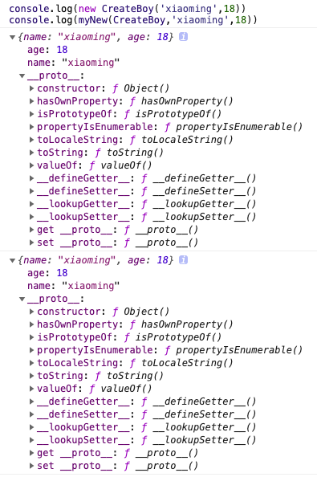
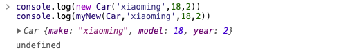

从零开始,实现手写New关键字

<!-- more -->

# 简单实现 new 运算符

## 关于 new 

> 对于new关键字,在我开始的理解中只是构建一个新的对象,并且内存指向不同避免JavaScript的浅拷贝一样的效果,但是在2020-09-18的每日一练中发现了不同的用法,所以来深入了解一下 new 运算符

## 概述

> new 运算符创建一个用户定义的对象类型的实例或具有构造函数的内置对象的实例
[参考文献](https://developer.mozilla.org/zh-CN/docs/Web/JavaScript/Reference/Operators/new)

### 语法

new constructor[([arguments])]

### 参数

constructor : 一个指定对象实例的类型的类或函数

arguments : 一个用于被 constructor 调用的参数列表

### 描述

new 关键字会进行如下的操作：

- 创建一个空的简单 JavaScript 对象（即{}）；

- 链接该对象（设置该对象的 constructor ）到另一个对象 ；

- 将步骤1新创建的对象作为 this 的上下文 ；

- 如果该函数没有返回对象，则返回 this

## 尝试手写new

```js
function CreateBoy(name,age){ //构造函数
  return {
    name,
    age
  };
}

function myNew(fn,...args){ //fn可能是一个对象/函数/字符串,args接收其他参数
  let obj = new Object();//先创建一个新的对象
  obj.__proto__ = fn.prototype;//将对象和构造函数的原型关联
  // 或采用较新的写法 let obj = Object.create(fn.prototype);
  return fn.apply(obj,args);
}
```

测试一下



测试结果和 new 完全一样,到此为止了么?并不是的

> 我查了下 [MDN](https://developer.mozilla.org/zh-CN/docs/Web/JavaScript/Reference/Operators/new) 一下,发现他写的构造函数并没有返回一个对象
```js
function Car(make, model, year) {
  this.make = make;
  this.model = model;
  this.year = year;
}
```
那我的写的 myNew 可以对这种函数做兼容么? 我们来测试一下



> 啊!果然意料之中的 undefined

思考了一下,因为我的 myNew中 return 的是 fn 的执行结果,如果他不返回一个对象 当然是不行的

```js
function myNew(fn,...args){ //fn可能是一个对象/函数/字符串,args接收其他参数
  let obj = new Object();//先创建一个新的对象
  obj.__proto__ = fn.prototype;//将对象和构造函数的原型关联
  // 或采用较新的写法 let obj = Object.create(fn.prototype);
  let res = fn.apply(obj,args)
  return res || obj; //如果res存在,构造函数有返回值,那就返回res 否则obj
}
```

这样就完美的解决了构造函数是否有返回值的情况下 myNew 的返回问题
